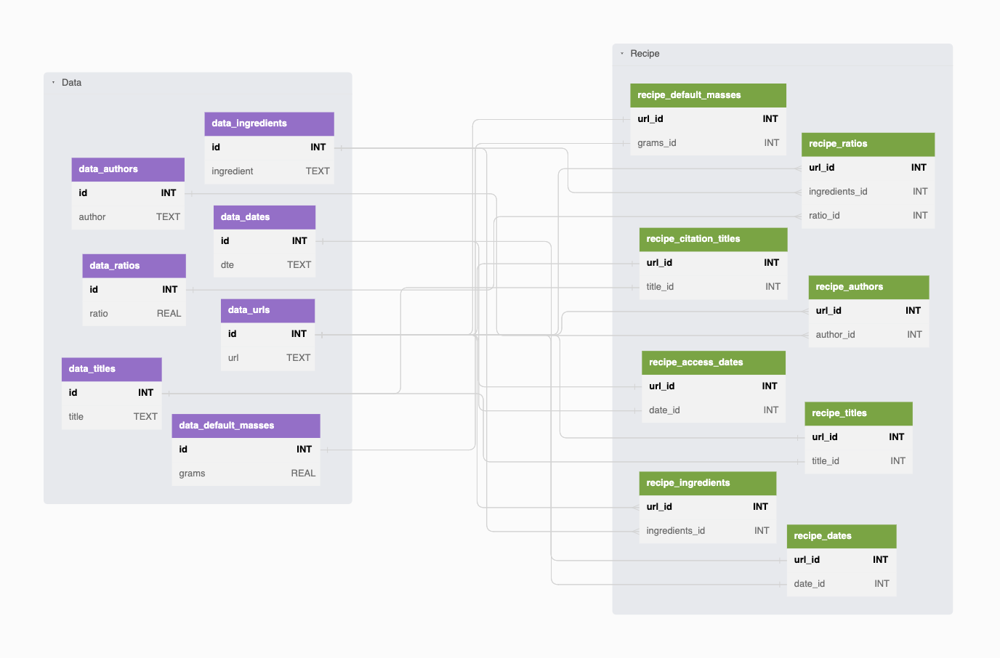

# Baker's Percentage Calculator Database Bootstrap Tool

Bootstrap scripts for the [SQLite][sqlite] databased used by [Baker's Percentage Calculator][bpcalcobs]. Add recipes by editing the CSVs in `data/` then run `python/csv-to-sqlite.py` to transform them into a ready-to-deploy 6th Normal Form SQL database.

## Using
- Install [Poetry][pypoetry]
  - https://python-poetry.org/docs/#installation
- Clone repository
- `cd 6nf-recipes`
- `poetry install`
- `poetry run python3 python/csv-to-sqlite.py`
  - Outputs `[YYYY-mm-dd]_bp_recipes.db`

## Feature List
- [x] [dbml][dbml] for generating SQL (via [dbml-cli][dbmlcli])
  - **NOTE** dbml does not support SQLite output, so `sql/schema.sql` is manually edited after generation
- [x] Populate database by "decomposing" human-readable spreadsheets
  - [x] Refactor dataset
  - [x] Write Python script to
    - [x] Load CSV data
    - [x] Restructure CSV data
    - [x] Create SQLite database
    - [x] Populate SQLite database with
      - [x] Data
      - [x] Schema
      - [x] Relations
      - [x] Views
        - [x] Ingredients list
        - [x] Recipe citations
        - [x] Recipe default mass
        - [x] Recipe list
    - [x] Validate data written to database

## Schema

[[pdf](dbml/schema.pdf) | [dbdiagram.io interactive visualization](https://dbdiagram.io/d/63dfc0d0296d97641d7e8c4f)]

### Tables and Views
| Name                        | Type  | Description                                                            | Constraints          |
|-----------------------------|:-----:|------------------------------------------------------------------------|:--------------------:|
| `data_authors`              | Table | Formatted names of recipe authors                                      | _UNIQUE_             |
| `data_dates`                | Table | Formatted recipe publication and access dates                          | _UNIQUE_             |
| `data_ingredients`          | Table | Names of ingredients for all recipes                                   | _UNIQUE_             |
| `data_default_masses`       | Table | Default mass values for all recipes                                    | _UNIQUE_             |
| `data_ratios`               | Table | Default baker's percentages for all recipes                            | _UNIQUE_             |
| `data_titles`               | Table | Formatted titles for recipes and citations                             | _UNIQUE_             |
| `data_urls`                 | Table | URL for each recipe                                                    | _UNIQUE, GLOBAL KEY_ |
| `recipe_access_dates`       | Table | `(url_id, date_id)` pairs for citation access dates                    | _UNIQUE TUPLE_       |
| `recipe_authors`            | Table | `(url_id, author_id)` pairs for citation authors                       | _UNIQUE TUPLE_       |
| `recipe_bakers_percentages` | Table | `(url_id, ingredient_id, ratio_id)` pairs for recipe ingredients lists | _UNIQUE TUPLE_       |
| `recipe_citation_titles`    | Table | `(url_id, title_id)` pairs for citation titles                         | _UNIQUE TUPLE_       |
| `recipe_dates`              | Table | `(url_id, date_id)` pairs for recipe publication dates                 | _UNIQUE TUPLE_       |
| `recipe_default_masses`     | Table | `(url_id, grams_id)` pairs for recipe default masses                   | _UNIQUE TUPLE_       |
| `recipe_titles`             | Table | `(url_id,title_id)` pairs for recipe titles                            | _UNIQUE TUPLE_       |
| `citations`                 | View  | Citations for each recipe with formatted strings, keyed by `url_id`    |                      |
| `default_masses`            | View  | `(url_id, grams)` for each recipe                                      |                      |
| `ingredient_list`           | View  | `(url_id, ingredient, ratio)` for each recipe                          |                      |
| `recipe_list`               | View  | `(url_id, title)` for each recipe                                      |                      |

[bpcalcobs]: https://observablehq.com/@jagrafft/bakers-percentage-calculator
[dbml]: https://www.dbml.org/
[dbmlcli]: https://www.dbml.org/cli/
[pypoetry]: https://python-poetry.org
[sqlite]: https://www.sqlite.org/
